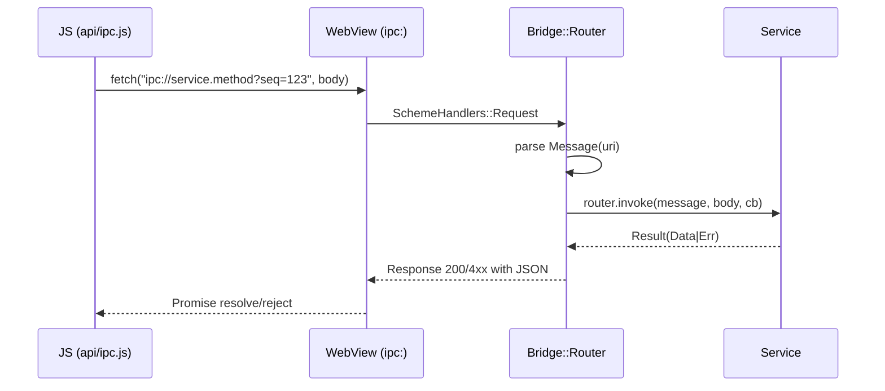
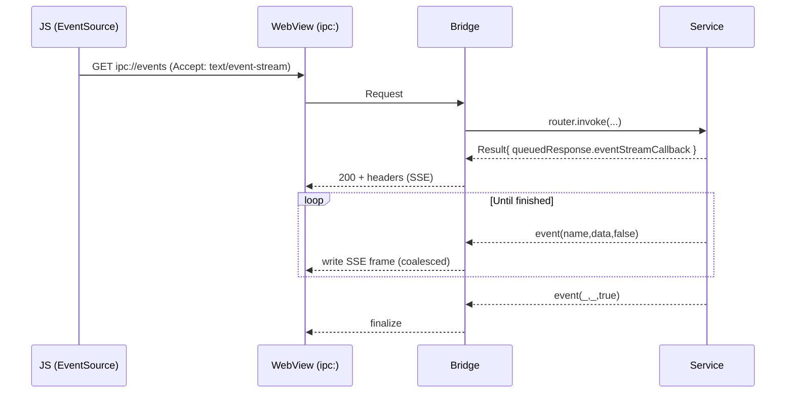
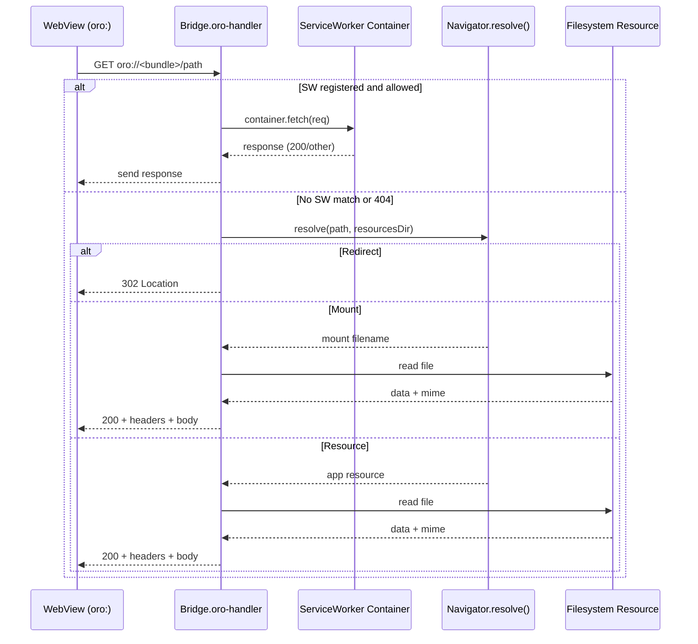
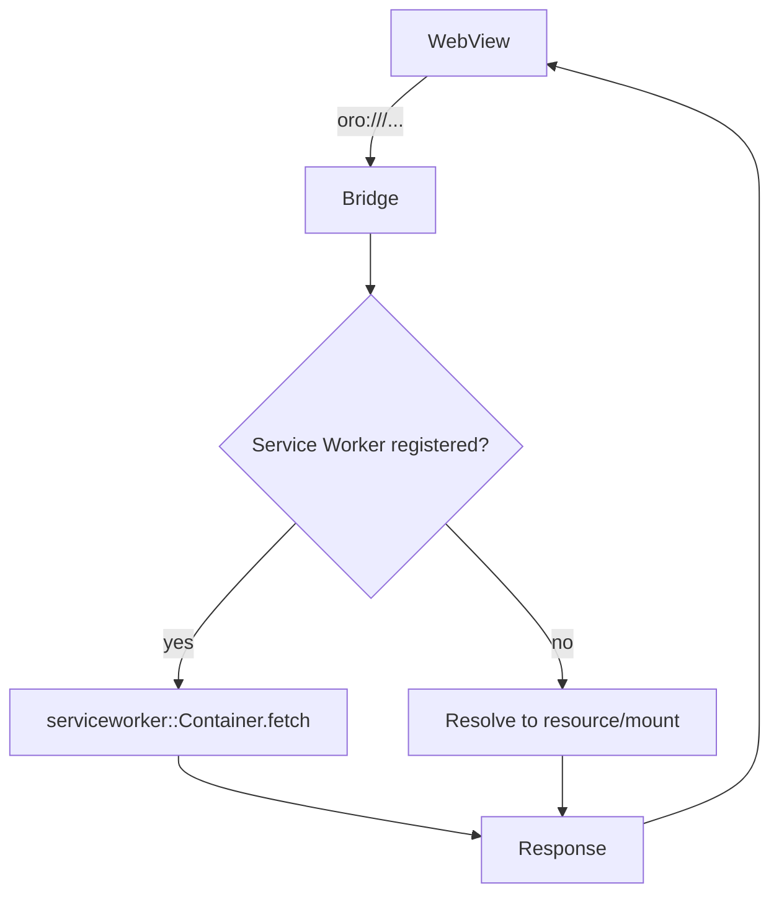
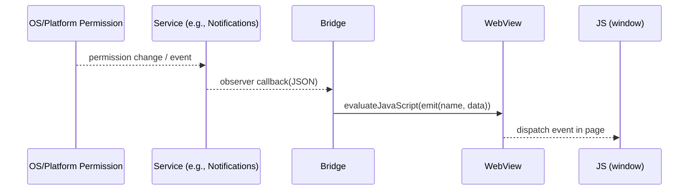
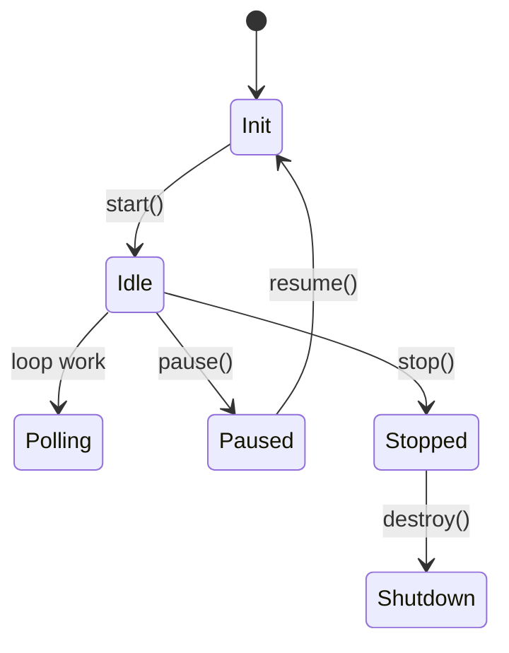
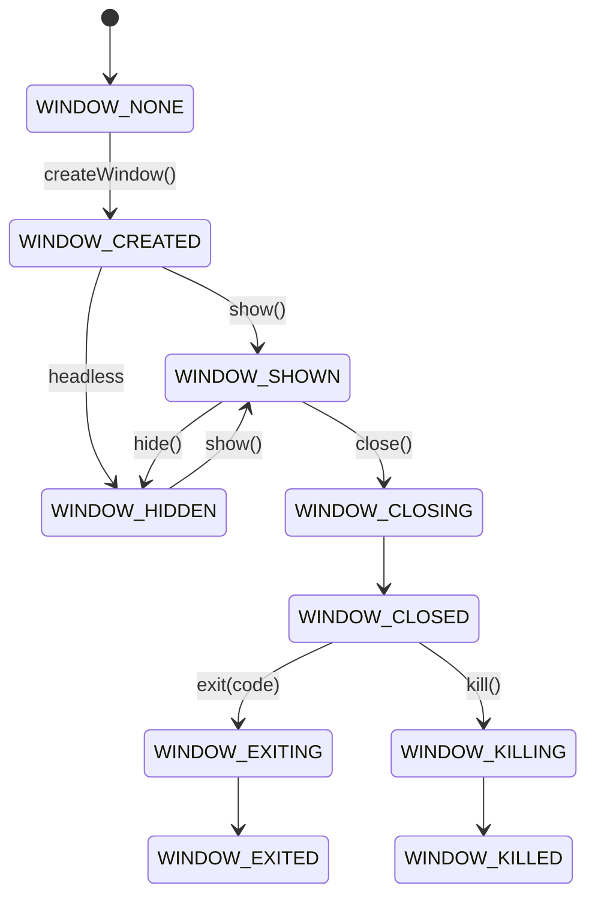

# Oro Runtime Architecture

This document provides a detailed view of the Oro Runtime internals (with notes for legacy Socket compatibility), including its threading model, IPC pipeline, services layer, resource loading, lifecycle, and security boundaries. It is intended for contributors and advanced users integrating or extending the native runtime.

Contents

- Goals and topology
- Diagram index
- Component map
- Threading and event loops
- IPC routing and flows
- IPC types (class diagram)
- Services architecture
- Windows/WebView integration
- Resource loading and Service Worker
- Lifecycle model
- Window states (state diagram)
- Security and configuration
- Performance and reliability
- Extension points
- Directory map and anchors
- Known gaps and future work

See also: `start.md`, `CONDUIT.md`, `NAVIGATOR_MOUNTS.md`, `TLS_QUICKSTART.md`, `TLS_TESTING.md`, `WEBVIEW_TLS_PINS.md`

## Goals

- Unified, lean native runtime powering cross‑platform desktop and mobile.
- Rich JS APIs via custom schemes and a resilient IPC bridge.
- Deterministic dispatching: isolate UI/main thread work from loop work.
- Modular native services with feature gating and explicit lifecycles.
- Safe defaults: scheme isolation, optional filesystem sandbox, CORS/CSP knobs.

## Component Map

```mermaid
graph LR
  subgraph JS[JS Layer (ESM APIs)]
    A1[api/bootstrap.js]
    A2[api/ipc.js]
    A3[api/fs/*]
    A4[api/dgram.js]
    A5[api/window.js]
  end

  subgraph WV[WebView]
    B1[Preload Hooks]
    B2[window <-> bridge]
  end

  subgraph BR[Bridge]
    C1[SchemeHandlers
      - ipc:
      - oro:
      - node:]
    C2[Router]
    C3[Navigator + Mounts]
  end

  subgraph RT[Runtime Core]
    D1[loop::Loop (libuv)]
    D2[context::Dispatcher]
    D3[context::RuntimeContext]
    D4[core::Services]
    D5[window::Manager]
    D6[serviceworker::Server/Container]
  end

  JS -- fetch ipc:// --> C1
  JS -- import oro:/node: --> C1
  C1 -- route --> C2
  C2 -- invoke --> D4
  D4 -- callbacks --> C2
  C2 -- reply (send/eval) --> B2
  B2 --> JS

  D5 <--> WV
  D2 -. UI/Main thread dispatch .-> WV
  D1 -. uv_async / loop thread .-> D4
  C3 -- resolve() --> C1

  C1 <-- dev/prod resources --> C3
  C3 --> D6
```

## Diagram Index

- Component Map: overview of JS, WebView, Bridge, Runtime, Services
- Threading Model: UI/main vs loop thread dispatch
- IPC Request/Response: standard request path
- IPC Streaming: SSE/chunked flows
- IPC Types: class diagram for key IPC types
- Oro Scheme Resolution: end-to-end request path with Service Worker fallback
- Permissions/Event Emission: system event propagation to JS
- Runtime Lifecycle: high-level runtime state machine
- Window States: window manager status transitions

## Rendering Diagrams

- Preview in Markdown: most editors (VS Code with Mermaid) render ```mermaid blocks inline.
- Export SVG locally: `npm run docs:diagrams` (writes to `build/diagrams`).
- Export PNG locally: `npm run docs:diagrams:png`.
- CI artifacts: a GitHub workflow renders diagrams on pushes/PRs touching docs and uploads them as an artifact named `runtime-diagrams`.

## Threading and Event Loops

The runtime separates concerns between:

- loop thread: libuv‑based work, timers, IO; runs callbacks enqueued via `Loop::dispatch()`.
- UI/main thread: platform WebView and windowing; accessed via `context::Dispatcher`.
- background threads: optional worker threads spawned by services (e.g., process, UDP) and platform internals.

Key primitives

- `src/runtime/loop/loop.cc`: backing libuv loop, `uv_async_t` for dispatch, platform integration.
- `src/runtime/context/dispatch.cc`: platform‑specific marshaling to UI/main thread.

```mermaid
flowchart LR
  subgraph UI[UI/Main Thread]
    U1[WebView + Window]
    U2[Dispatcher::dispatch(cb)]
  end
  subgraph UV[Loop Thread]
    L1[Loop::dispatch(cb)]
    L2[uv_async_t]
    L3[Run Queue]
  end
  U1 <-- synchronous UI work --> U2
  L1 --> L2 --> L3 --> U1
  U2 -->|platform invoke| U1

  classDef main fill:#eef,stroke:#88f
  classDef loop fill:#efe,stroke:#8b8
  class U1,U2 main
  class L1,L2,L3 loop
```

Platform specifics

- Linux: integrates `uv_backend_fd` with GTK main loop via `GSource` (prepare/check/dispatch); see `src/runtime/loop/loop.cc`.
- Apple: loop may run on a dedicated thread; UI work is `dispatch_sync` onto main queue.
- Windows: dispatcher uses `WM_APP` posts targeting the captured main thread; queued until `notifyReady()`; see `src/runtime/context/dispatch.cc`.
- Android: posts through the JVM/Looper to the activity thread.

Loop states

- `None → Init → Idle ↔ Polling → Paused/Stopped → Shutdown`.
- `Loop::dispatch()` transitions to Polling while draining queue; resumes Idle afterward.

## IPC Routing and Flows

The bridge installs custom scheme handlers in the WebView. The JS layer performs IPC by issuing HTTP‑like requests to `ipc://` with a JSON body; results are sent back via `evaluateJavaScript()` or streamed via queued responses.

Main types

- `src/runtime/ipc.hh`: `ipc::Message`, `ipc::Result`, `ipc::Router`.
- `src/runtime/bridge/bridge.cc`: scheme handlers, coalesced SSE/chunk writes, JavaScript resolution.

Basic request/response



Queued responses and streaming

- Queued body: service sets `QueuedResponse{body,length,headers}`, bridge serializes minimal JS to resolve client when the renderer pulls the queue.
- SSE: `QueuedResponse::eventStreamCallback` emits `text/event-stream` events; bridge coalesces small writes for efficiency.
- Chunked: `QueuedResponse::chunkStreamCallback` emits chunked transfer; bridge buffers to 16KB threshold before writes.



Oro scheme resolution (detailed)



Cancellation

- WebView cancels pending requests (navigation, network abort); `SchemeHandlers::RequestCallbacks.cancel` triggers `MessageCancellation` if provided.

Windows note

- WebView2 may buffer custom‑scheme bodies; incremental delivery of SSE/chunked responses is not guaranteed.

## Services Architecture

Services expose native capabilities and map IPC routes to API semantics.

Key pieces

- `src/runtime/core/services.hh`: registry and lifecycle.
- Service examples: FS, DNS, Timers, UDP, OS, Process, SQLite, NetworkStatus, Notifications, MediaDevices, Geolocation, TLS, Diagnostics, AI.
- SQLite depends on the amalgamation staged at `build/sqlite/sqlite3.c`; `bin/install.sh` (and CI bootstrap) should run `bin/fetch-sqlite.sh` or set `SQLITE_SOURCE_DIR` before building.
- Each service gets `context`, `dispatcher`, `loop`, and manages its own handles and observers.

Lifecycle

- `core::Services::start()`/`stop()` called by `runtime::Runtime` on resume/pause/stop.
- Feature gating enables/disables specific services by build/user config.

Concurrency patterns

- Long‑running or blocking operations are scheduled on the loop thread.
- UI‑bound work (dialogs, permission prompts) marshaled via `dispatcher.dispatch()`.
- libuv handles must be closed explicitly; prefer `uv_close(handle, cb)` where state needs cleaning.

## Windows and WebView Integration

Window lifecycle and lookup

- `src/runtime/window/manager.cc`: indexed manager tracks windows and their status transitions (`NONE → CREATED → SHOWN/HIDDEN → CLOSING → EXITING`).
- Each window owns a `bridge::Bridge`, which owns `Navigator` and `SchemeHandlers`.
- Manager can resolve windows by bridge, webview, or client id.

Bridge responsibilities

- `src/runtime/bridge/bridge.cc`:
  - inject preload, set up scheme handlers (ipc, oro, node)
  - route IPC to services; marshal results to JS (resolve/emit)
  - coalesce SSE and chunked writes
  - integrate Service Worker proxying for `oro:` origin

WebView custom schemes (`src/runtime/webview.hh`)

- `SchemeHandlers::Request/Response` wrap platform handles and headers/body.
- Platform typedefs unify Apple/Linux/Windows/Android request/response types.
- `Navigator` maintains origin, mounts, resolution logic and can block/allow navigation.

## Resource Loading and Service Worker

Module and asset delivery paths

- `oro:` scheme
  - Serves packaged app assets or dev resources directory.
  - Honors `webview_default_index` fallback when resolving.
  - Supports SPA fallback when enabled via `webview_allow_any_route = true` (unmatched routes fall back to the default index, typically `/index.html`).
  - Integrates with Service Worker Server when registration exists for origin.
- `node:` scheme
  - Proxies allowed Node core module imports to packaged shims `/oro/<module>.js`.
  - Produces an ESM proxy module ensuring a canonical module instance URL.



Permissions and event emission



Service Worker Server

- `src/runtime/serviceworker/server.cc` creates a hidden headless window per origin when needed; toggled by `ORO_SERVICE_WORKER_DEBUG` env.
- Streams and fetch path are coordinated via bridge maps (`swPending*`, `swActive*`).

## Lifecycle Model

High‑level app events are emitted to windows via `window::Manager.emit()` and bridged to JS (mirrors host window activation/minimize).



## Window States (state diagram)



Platform mapping summary

- iOS/macOS/Android/Windows/Linux map activation/background/terminate to `applicationpause`/`applicationresume`/`applicationstop` events. On desktop, native pause/resume is opt‑in (`lifecycle_desktop_always_running = false`).
- File watchers are stopped on pause; recreate on `applicationresume` as needed.

## Security and Configuration

Boundaries

- Scheme isolation: only registered schemes are allowed; `node:` restricts module list.
- JS only gains native capabilities through IPC routes, which consult permissions/config.
- Optional filesystem sandbox and symlink restrictions.

Key config (oro.toml or env overrides)

- Filesystem sandbox: `filesystem_sandbox_enabled`, `FS_SANDBOX=1`.
- No‑follow symlinks: `filesystem_no_follow_symlinks`, `FS_NOFOLLOW=1`.
- WebView headers: `webview_csp`, `webview_referrer_policy`, `webview_cors_*`.
- Lifecycle desktop behavior: `lifecycle_desktop_always_running`.
- Service Worker debug: `ORO_SERVICE_WORKER_DEBUG`.

## Performance and Reliability

Event/write coalescing

- SSE: coalesce small events before flush to reduce per‑frame overhead.
- Chunked: buffer chunks to 16KB before write to reduce syscall pressure.

Libuv loop shutdown (`src/runtime/loop/loop.cc`)

- Ensure `uv_stop` + `uv_run(NOWAIT)`, close async handle, repeatedly try `uv_loop_close`, walk/close remaining handles, retry, with small sleeps to yield; avoids leaks/hangs on shutdown.

Dispatch correctness

- UI work must go through `context::Dispatcher` to avoid thread affinity bugs.
- On Windows, dispatcher captures main thread id, posts `WM_APP` messages, and queues until `notifyReady()`.

Handle lifecycle

- Prefer `uv_close(handle, callback)` when state updates are needed; avoid relying on nulling pointers.

## Extension Points

Add a new service

1. Create `src/runtime/core/services/<name>.hh/.cc` exposing IPC‑level methods with signatures `(const ipc::Message::Seq&, Params..., Callback)`.
2. Register routes in `src/runtime/ipc/routes.cc` mapping `"<service>.<method>"` to service calls.
3. Add feature flag in `core::Services::Features` and include in lifecycle `start()/stop()`.
4. Expose JS surface under `api/` (and update `api/index.d.ts`).

Add an IPC route

- Map in `ipc::Router::map(name, callback)` or via `routes.cc`. Use `dispatcher` for UI‑bound actions and `loop.dispatch` for loop‑bound work.

Serve custom content

- Register a new scheme via `SchemeHandlers.registerSchemeHandler("myscheme", handler)` in the bridge (or extend platform registration if needed).

Integrate a Service Worker behavior

- Extend `serviceworker::Container` and fetch handling; use bridge `swPending*` and `swActive*` maps for streaming coordination.

## Directory Map and Anchors

- Loop and Dispatch
  - src/runtime/loop/loop.cc
  - src/runtime/context/dispatch.cc
- Bridge and IPC
  - src/runtime/bridge.hh
  - src/runtime/bridge/bridge.cc
  - src/runtime/ipc.hh
  - src/runtime/ipc/message.cc
  - src/runtime/ipc/router.cc
  - src/runtime/ipc/routes.cc
- WebView and Windowing
  - src/runtime/webview.hh
  - src/runtime/window/manager.cc
  - src/runtime/window/\*.cc|.mm|.kt|.cc (platforms)
- Services
  - src/runtime/core/services.hh
  - src/runtime/core/services/\*.cc|.hh
- Service Worker
  - src/runtime/serviceworker/server.cc
  - src/runtime/serviceworker/\*.cc
- Runtime Container
  - src/runtime/runtime.hh

JS surface (ESM proxies and APIs)

- api/_.js and api/_.d.ts
- api/ipc.js (IPC client), api/\* for service surfaces

## Known Gaps and Future Work

- Tighten timers ownership and ensure consistent `uv_close` semantics across services.
- Validate Windows dispatcher end‑to‑end scenarios and lifecycle edge cases.
- Audit window manager read locks and enumerations for thread safety.
- Recreate FS watchers on resume with helper utilities.
- Windows WebView2 buffering: evaluate alternative strategies for streaming (e.g., WebSocket/SSE polyfills) when the custom `oro:` scheme is buffered.

## Appendix: Example Sequence Annotations

Queued response script injection

- `src/runtime/context/context.cc` creates a small JS program that notifies the renderer of queued response IDs so the JS side can fetch payloads/bodies lazily.

Node core module proxying

- `src/runtime/bridge/bridge.cc` generates an ESM proxy to the canonical `oro://.../oro/<module>.js` path to ensure a single module instance across import URLs.

Service Worker server window

- `src/runtime/serviceworker/server.cc` spawns a hidden window per origin; toggled by env; ensures consistent SW lifecycle and debugging hooks.

## IPC Types (class diagram)

```mermaid
classDiagram
  class ipc::Message {
    +bytes::BufferQueue buffer
    +Client client
    +URL uri
    +String seq
    +bool isHTTP
  }

  class QueuedResponse {
    +ID id
    +uint64_t ttl
    +SharedPtr<byte[]> body
    +size_t length
    +http::Headers headers
    +EventStreamCallback*
    +ChunkStreamCallback*
  }

  class ipc::Result {
    +Message message
    +String seq
    +JSON::Any value
    +http::Headers headers
    +QueuedResponse queuedResponse
  }

  class ipc::Router {
    +map(name, cb)
    +invoke(Message, body, cb)
    +listen(name, cb)
    +unlisten(name, token)
  }

  class bridge::Bridge {
    +SchemeHandlers schemeHandlers
    +Navigator navigator
    +ipc::Router router
    +bool send(seq, json, qr)
    +bool emit(name, json)
  }

  class webview::SchemeHandlers {
    +registerSchemeHandler(scheme, handler)
    +handleRequest(Request, cb)
  }

  class webview::Navigator {
    +Location location
    +configureWebView(wv)
    +resolve(path, dir)
  }

  ipc::Router <-- bridge::Bridge
  webview::SchemeHandlers <-- bridge::Bridge
  webview::Navigator <-- bridge::Bridge
  ipc::Result --> QueuedResponse
  ipc::Result --> ipc::Message
```
